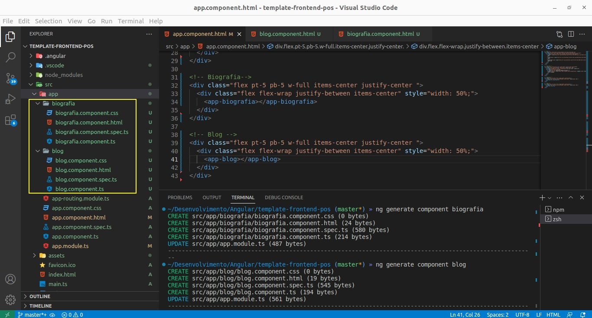

# Template Frontend

### Tecnologia Utilizada:
---
* Angular CLI: 16.1.3
* Node: 18.16.1
* Package Manager: npm 9.5.1
* OS: linux x64 - Ubuntu 22.04.2 LTS

Packages:
---     
* @angular-devkit/architect       0.1601.3
* @angular-devkit/build-angular   16.1.3
* @angular-devkit/core            16.1.3
* @angular-devkit/schematics      16.1.3
* @schematics/angular             16.1.3
* rxjs                            7.8.1
* typescript                      5.1.6
* tailwindcss                     3.3.2

### Front-End:
---

```txt
Rodar projeto:

npm i
npm run serve

Abrir Browser: http://localhost:4200/ 
```




